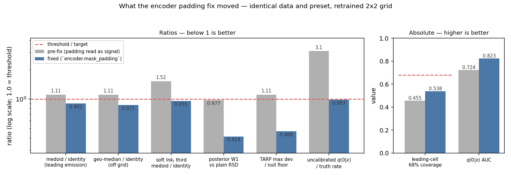
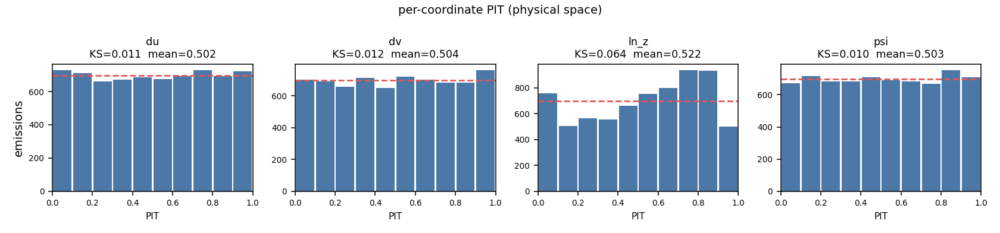
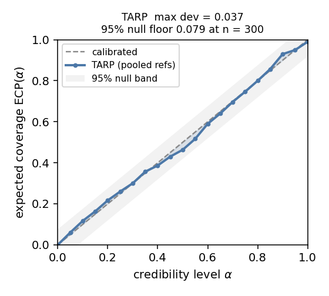
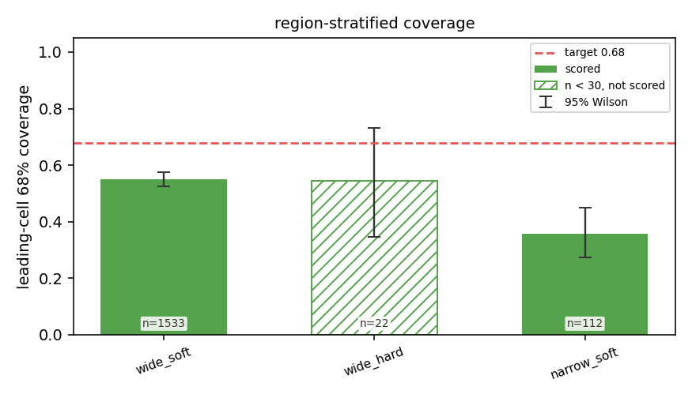
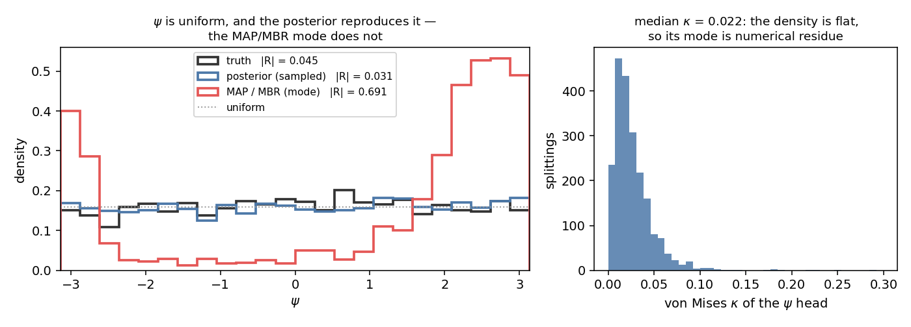

# Production test v0 — results

**Run 2026-08-01.** The end-to-end production test specified by
[`PLAN_prod_test_v0.md`](PLAN_prod_test_v0.md): one arm of the SOTA AR family trained at
`n_bins: 30` on an asymmetric-floor PYTHIA file and assessed on an **independent file from
a different seed**. This document holds the results; the plan holds the design and the
rationale. Read the plan for *why* each check exists.

**Verdict: the arm passes.** It beats the identity baseline on both acceptance
estimators, the aux conditioning it was built to test helps, and the posterior is
well-calibrated as a *tree* though not yet as a *multiplicity*.

The run was performed **twice**. The first pass exposed a defect in the encoders that the
assessment itself could not have found, and every number here comes from arms retrained
with it fixed. That story is [§2](#2-what-the-encoder-fix-changed), and it is the single
most useful thing this exercise produced.

| | |
|---|---|
| checkpoint | `runs/prod_test_v0/20260731-212800-8209a78a33/best.ckpt` |
| model | `ar_junipr_v4` + `lundnet`, 264 774 params, 60 epochs (best at 39) |
| geometry | `n_bins = 30` → 900 cells, cell 0.20 × 0.20 |
| train | `data/jet_aux_asym.root` — 495 071 jets, 230 000 events, seed 1 |
| test | `data/jet_aux_asym_test.root` — 97 018 jets, 45 000 events, seed 2 |
| grooming | `z_cut = 0.1`, `beta = 0`, `kt_floor = 1.0`, **`kt_floor_sec = 0.2`** |
| artifacts | `prod_test_v0_metrics.json`, `eval_metrics.json`, `dist_closure_metrics.json` |

Reproduce with [`notebooks/prod_test_v0.ipynb`](../notebooks/prod_test_v0.ipynb) and
[`notebooks/lund_distribution_closure_prod_test_v0.ipynb`](../notebooks/lund_distribution_closure_prod_test_v0.ipynb);
regenerate the figures below with `python scripts/make_prod_test_figures.py`.

---

## 1. Is the test valid?

Three things had to be true before any number below means anything.

**The seeds did not collide.** Both files come from the same binary and the same card,
differing only by a seed that `pythia_driver` reduces modulo 900000000. If the streams
overlapped, "held out" would be false and every number here would be a training number.
[`scripts/check_disjoint.py`](../scripts/check_disjoint.py) found **0 shared jets of
20 000 compared**, with identical provenance tuples and differing content fingerprints.

The plan asked to hash the `(x, y)` buffers; that turned out to be necessary but not
sufficient. The mean groomed sequence is ~1.8 nodes, so the sequences alone identify only
**7%** of jets (1 349 of 20 000 at a ≥3-emission bar) — every empty-tree jet hashes like
every other. The script therefore reports two sets: `full` (sequences **plus** the jet
four-vector, covering every jet read) and `seq` (the plan's definition). Both are empty.

**The file is actually asymmetric.** Over all 97 018 test jets `⟨x_nsec⟩ = 2.10` with a
**21.9%** zero fraction, against 0.25 and 82.6% on the symmetric reference. The five
secondary-plane features are no longer constant-zero four times in five — which is the
entire reason this file was generated.

**Train and test agree.** The two differ only by seed, so their disagreement is the
same-generator noise floor and the stand-in for the blocked PYTHIA-vs-HERWIG systematic.
Every marginal agrees to better than 1.5% relative: `⟨n_y⟩` +0.08%, `P(n_y = 0)` +0.11%,
`⟨n_x⟩` −0.34%, `P(n_x = 0)` +1.47%, `⟨x_nsec⟩` −0.50%, `⟨jet p_T⟩` −0.33%. Any future
generator spread is a finding only where it exceeds these.

---

## 2. What the encoder fix changed

Running the closure notebook against the first pass turned up a `q(0|x)` that disagreed
with the artifact by 3×. The cause was not in the gate: **`gru` and `lundnet` both read
the zero-padding `collate` adds**, so `e(x)` was a function of the batch composition.

* `gru` ran a **bidirectional** GRU over the padded tensor, so the backward pass started
  in the padding and swept through it into the real nodes.
* `lundnet`'s chain EdgeConv self-looped at `h[:, -1]` — the last row of the *padded*
  tensor rather than each jet's last real node — so a jet's final node took its neighbour
  from padding and its edge feature became `−h`. On this sample ~40% of jets have
  `nx = 1`, and for those that node *is* the jet.

Wrong on its own terms, and worse in consequence: training is always batched, while
single-jet inference (`sample`, `map_estimate`, `length_pmf`) has `Mx = nx` and no padding
at all. **The model was decoded from a context distribution it had never been trained on.**
On the first-pass checkpoint the same 256 jets gave mean `q(0|x)` = 0.053 decoded one at a
time and 0.155 in a batch — max per-jet difference 0.59 *on a probability*.

Fixed behind `encoder.mask_padding` (default true; `deepsets` was already correct, and a
pre-field snapshot backfills to the legacy path so it still evaluates as it was trained).
Retraining the identical grid:

**Three of the first pass's headline conclusions were artifacts of it:**

1. *"The arm loses to identity."* It does not — it beats identity on both estimators.
2. *"Localized under-conditioning in the soft/wide-angle corner"*, which the first pass
   called its most actionable finding. The soft `ln k_t` third went 1.520 → 0.955; all
   three thirds now beat identity. The mechanism is consistent — soft/wide-angle emissions
   dominate the `nx = 1` jets whose whole context was corrupted.
3. *"The length head is ~3× under-confident and needs the tilt."* After the fix the head is
   calibrated essentially out of the box, and `fit_length_recalibration` returns the
   identity to within 1%.

None of the unit tests, the parity check, or the training curves could have caught this:
every one of them lives on **one side** of the train/inference boundary. That is what an
end-to-end production test is for.

The reference script has the same defect, so `scripts/verify_parity.py` and
`tests/test_parity.py` pin `mask_padding=false` and say why — parity measures the refactor
against the reference *as it is*, and is back to max |Δ| = 0.0.
[`tests/test_encoder_padding.py`](../tests/test_encoder_padding.py) pins batch-invariance
for all three encoders, including that `per_jet_nll` no longer depends on how the eval loop
chunked the file.

---

## 3. Acceptance: PASS

Cell level on 2 000 jets (1 667 with a truth leading emission — an 83.4% kept fraction, so
every `dlund_*` is `p(leading | n_y > 0)`), off-grid on 300:

| estimator | cell (2 000 jets) | off-grid (300 jets) |
|---|---|---|
| identity(x) | 0.651 | 0.647 |
| posterior mode | 0.679 | — |
| **medoid / geo-median** | **0.587 (0.902)** | **0.564 (0.871)** |

Beats identity on both, agreeing in sign — the criterion
[`PLAN_ProductionAssessment.md`](PLAN_ProductionAssessment.md) §9 as amended asks for. And
the gain is not localised:

| truth leading `ln k_t` | jets | identity | medoid | ratio |
|---|---|---|---|---|
| soft [0.00, 0.79] | 556 | 0.709 | 0.677 | **0.955** |
| middle [0.79, 1.53] | 555 | 0.656 | 0.556 | **0.847** |
| hard [1.53, 3.79] | 556 | 0.598 | 0.532 | **0.889** |

The population view agrees. `dist_closure_metrics.json` puts the decode-free posterior
series at a **0.414** W1 geometric-mean ratio against plain RSD, winning 10 of 14 scoreable
observables (KS 0.419, 10/13; χ² 0.315, 8/10). MAP and MBR remain *worse* than plain RSD
(1.83 and 1.28), so **the decode is still the weak link** while the density underneath it
is clearly better than the baseline.

> One caveat on those MAP/MBR aggregates: the pooled `psi` row is scoreable and sits at
> **17.5×** for both, which inflates them. See [§6](#6-why-the-mapmbr-ψ-panels-look-wrong).

---

## 4. Calibration

Every statistic quoted against its null, 2 000-jet tier:

| statistic | value | reference | verdict |
|---|---|---|---|
| leading-cell 68% coverage | **0.538** [0.514, 0.562] | 0.68 | over-confident |
| `sbc_chi2_uniform` | **107.0** | χ²(9) 95% = 16.90 | non-uniform |
| `tarp_max_dev` | **0.037** | null floor 0.079 | **consistent with calibrated** |
| ECP(0.68) | **0.674** | 0.68 | on target |
| per-coordinate PIT, worst | `ln z` **0.066 ± 0.008** | KS crit 0.016 | miscalibrated |

`du` (0.013), `dv` (0.011) and `ψ` (0.012) all pass comfortably. That answers a preset
question directly: **`sigma_floor: 0.005` was the right call** — `du`/`dv` are the
within-cell offsets whose support narrowed 3× with `n_bins`, and a binding floor shows up
as a U-shaped over-confident PIT. They are the two best-calibrated coordinates. `ln z` is
the one genuine failure.

**The tension worth naming:** TARP — a *joint* test over the whole tree in the physics
metric — passes, while SBC-on-N and the leading-cell coverage do not. Those measure the
length marginal and a single cell; TARP measures the tree. Read together they say the
posterior's **shape** is close and its **multiplicity** is not, which the closure table
corroborates: `mean_mult_posterior` = 1.15 against a truth of 1.40, so the posterior now
*under*-produces emissions (before the fix it over-produced, 1.53).

The region panel is where the interval machinery earns itself. `wide_hard` reads 0.545 on
**22 jets** — interval [0.35, 0.73], consistent with almost anything — so it is reported
`scored: false` and drawn hollow rather than counted. The two scoreable quadrants both
fail, and differently: `wide_soft` 0.551 [0.53, 0.58] on 1 533 jets, `narrow_soft`
**0.357 [0.27, 0.45]** on 112. The collinear corner remains the worst region.
`narrow_hard` is empty outright — `u = ln(1/ΔR) ≥ ln(1/R) = 0.92` at `R = 0.4`, so a
mid-range split leaves that corner unreachable by kinematics rather than by the model.

---

## 5. The aux ablation — the scientific question

Held-out on the full 97 018-jet test file, four arms at 60 epochs each:

| arm | aux | seed | held-out NLL/jet | per-jet SD |
|---|---|---|---|---|
| `aux_s0` (headline) | on | 0 | **4.1063** | 3.51 |
| `aux_s1` | on | 1 | 4.1096 | 3.31 |
| `noaux_s0` | off | 0 | 4.1829 | 3.63 |
| `noaux_s1` | off | 1 | 4.1550 | 3.39 |

**aux ON − aux OFF = −0.0610 ± 0.0050 nat/jet** (paired SEM over 97 018 jets); seed band
0.0279, so `|delta| / band = 2.18`.

**Read that ratio carefully — this is where the previous A/B went wrong.** The delta is
well determined: the paired SEM bounds it at ±0.005. The *band* is not — it is `max` over
two arms of a **two-seed range**, with roughly 60% relative uncertainty and no error bar
of its own. An earlier pass on a 40 000-jet subsample of the *same four checkpoints*
returned band 0.0575 and delta −0.0560, i.e. **the opposite verdict**, purely because the
per-jet NLL spread is wide and the band is a difference of differences. The notebook now
evaluates on the whole file and cautions whenever the ratio is under 3, as it is here.

**The strata carry the result, and they need no band.** Aux rides as *constant per-node
columns of `xf`*, so a jet with an empty groomed hadron tree receives no aux signal at all:

| stratum | jets | aux on | aux off | delta | vs band |
|---|---|---|---|---|---|
| **`nx == 0` (control)** | 6 856 | 4.7669 | 4.7873 | **−0.0204** | **inside** |
| `nx > 0` | 90 162 | 4.0579 | 4.1219 | **−0.0641** | beyond |
| `n_sec == 0` | 21 241 | 3.5625 | 3.6222 | −0.0597 | beyond |
| `n_sec = 1` | 25 445 | 3.4706 | 3.5374 | −0.0667 | beyond |
| `n_sec = 2–3` | 31 128 | 4.2789 | 4.3348 | −0.0559 | beyond |
| `n_sec ≥ 4` | 19 204 | 5.2787 | 5.3418 | −0.0631 | beyond |

The control sits **inside** the band — consistent with no effect, which is what it must be
— while every stratum that *can* carry aux is 2× the band outside it. (The two arm types
differ in input width and hence initialisation, so some drift on the control is expected;
the point is that it is small and band-consistent.)

**So aux conditioning helps**, on a file where the secondary-plane features are not
degenerate. That could not have been established on `cpp/test_data/jets_aux.root`, which is
**not** an asymmetric-floor file at all — it predates the `kt_floor_sec` column, a claim
[`PLAN_ProductionAssessment.md`](PLAN_ProductionAssessment.md):334 got wrong and this run
corrected.

**What it does not isolate.** The preset's `aux_features` is nine columns of three kinds,
and the A/B moves all nine at once:

| columns | kind | defined for |
|---|---|---|
| `nsec`, `has_sec`, `ln_kt_sec`, `ln_kt_sec_sum`, `sec_depth` | secondary plane — what `ktFloorSec` unlocks | non-degenerate only when `n_sec > 0` |
| `ln_mg_pt`, `ln_ptg_pt` | groomed mass / momentum — **also redefined by the floor** | every jet with a node |
| `ln_pt`, `abs_eta` | jet kinematics, floor-independent | every jet with a node |

The `n_sec == 0` stratum still gains 0.0597 because four of the nine are defined for it
regardless. The supported claim is **"the nine-column aux set helps"**, not "the
secondary-plane features help". Isolating the latter needs a third arm whose control is
**`[ln_pt, abs_eta]`** — *not* all four non-secondary columns, since `ln_mg_pt`/`ln_ptg_pt`
are themselves complements of the off-spine tree.

---

## 6. Why the MAP/MBR ψ panels look wrong

They are not wrong; they are the mode of a flat distribution.

ψ is the azimuthal angle about the jet axis, so by symmetry it is uniform — and the head
has learned exactly that: **median von Mises κ = 0.022**, giving a peak-to-trough density
ratio of 1.04. The posterior series *samples* that density and reproduces truth (resultant
|R| = 0.03 against truth's 0.05). MAP and MBR take its **mode**, and at κ ≈ 0 the mode is
not identified: `_coord_params` computes `κ = √(a² + b²)` and `μ = atan2(b, a)` from the
same two outputs, so μ is the direction of a near-zero vector — deterministic given `x`,
carrying no information, and biased consistently enough across jets that every MAP emission
piles into the same few directions (|R| = 0.69).

Small κ is the head getting the **physics right**. What it breaks is the *estimator*, and
only for this coordinate. Two consequences worth carrying: the pooled ψ row is scoreable at
17.5× for MAP and MBR, so it inflates their geometric means in §3; and this is the sharpest
instance of the general rule that a per-jet argmax is narrower than truth by construction —
which is why the headline reads the decode-free posterior series.

---

## 7. The empty tree

`q(0|x)` AUC **0.823**, and after the encoder fix the *scale* is right too:

| variant | mean `q(0\|x)` | truth | emp/pred | NLL of N | AUC | Brier | reliability |
|---|---|---|---|---|---|---|---|
| uncalibrated | 0.1633 | 0.1605 | **0.983** | 1.1351 | 0.823 | 0.1092 | **0.0001** |
| temperature only | 0.1639 | 0.1605 | 0.979 | 1.1350 | 0.823 | 0.1092 | 0.0001 |
| temperature + tilt | 0.1619 | 0.1605 | 0.991 | 1.1347 | 0.823 | 0.1092 | 0.0001 |

Every column is flat to four decimals: `fit_length_recalibration` returns
`(T, tilt) = (1.010, +0.011)` and there is nothing for it to correct. **This retires a
conclusion**: the pre-fix pass measured 3.10× under-confidence and found the *tilt*
essential (temperature alone recovered a third of the gap), matching
[`PLAN_empty_parton_tree.md`](PLAN_empty_parton_tree.md) F5's ~2×. That defect was mostly
upstream, in the encoder.

**The gate transfers.** `tau = 0.3177`, fitted to reproduce the training-val empty rate and
applied **frozen** to the test file, gives `p_empty_pred = 0.171` against a truth of
**0.161** — ratio 1.067, recall 0.464, precision 0.435 (MBR backend `pot`).

`tau` is fitted on the **scale it is applied to**, which the first pass got wrong.
`empty_threshold_for_rate` returns a *quantile* of `q(0|x)`: scale-free in its ranking, but
a specific number on a specific distribution. Fitting on the raw head and applying to a
recalibrated one leaves the ranking untouched and the cut in the wrong place — measured on
the pre-fix checkpoint, rate 1.07× → **2.83×** with precision collapsing 0.439 → 0.306.
The artifact now records `tau.fitted_under`, and the closure notebook asserts the pair it
applies matches.

---

## 8. Capacity and support

**900 cells were affordable.** Truth occupies **275 of 900** cells (30.6%) over 137 353
emissions; the posterior emits 271, covers 256 of the truth-occupied ones and misses 19.
`split_head` ends in `Linear(64, 900)` — a rank bound of 64 with no analogue at 100 cells —
and its measured effective rank (spectral entropy) is **37.2 of 64**. The bound is not
saturated, so the residual under-coverage argues for more capacity in the *decoder* before
more cells, not for more data.

**Support.** Truth and identity(x) sit at exactly 0 out-of-window, 0 soft-drop violation, 0
`k_t`-floor violation over 137 353 and 168 521 emissions — the generator enforces the
window, so the floor is a hard zero. Against that the posterior's **0.88%** soft-drop
violation rate is entirely the model's: it places emissions below the `z_cut` boundary the
training data never crosses. Small, but a *support* error rather than a calibration one,
and nothing else in the suite surfaces it.

**NLL, by term** (check 1) — over 137 353 emissions in 97 018 jets:

| term | value | unit | comparable to 10 bins? |
|---|---|---|---|
| total | 4.1063 | per jet | **yes** — a density on the (ln 1/ΔR, ln k_t) plane |
| length `−ln q(N\|x)` | 1.1325 | per jet | **yes** — references no cell grid |
| split `−ln q(cell)` | 3.9172 | per emission | **no** — shifts by `2·ln 3 = 2.197` |
| coord `−ln p(du,dv,ln z,ψ)` | −1.8167 | per emission | **no** — pays that shift back |
| split + coord | 2.1005 | per emission | **yes** — the product is a density |

The caveat that survives: a finer grid is a **strictly richer density class**, so a lower
30-bin total is evidence of better resolution, not of a better conditional.

---

## 9. What is still broken

| # | issue | evidence |
|---|---|---|
| 1 | **`ln z` calibration** — the one failing coordinate, and it got *worse* under the encoder fix (0.047 → 0.066) | PIT KS 0.066 ± 0.008 vs crit 0.016 |
| 2 | **Multiplicity is over-confident and now under-produces** | coverage 0.538 [0.514, 0.562]; SBC χ² 107 vs 16.9; `mean_mult_posterior` 1.15 vs truth 1.40 |
| 3 | **`narrow_soft` quadrant** — the worst region even after the fix | 0.357 [0.27, 0.45] on 112 jets |
| 4 | **Soft-drop violations** — a support error, not a calibration one | 0.88% of posterior emissions vs a truth floor of exactly 0 |
| 5 | **MAP and MBR are worse than plain RSD** at population level; the decode is the weak link | W1 gmean 1.83 and 1.28 vs the posterior's 0.414 |

Issues 1 and 2 are the same suspect seen twice: `ln z` is unbounded-normal and the length
marginal is over-confident, and TARP passing while SBC-on-N fails localises the residue to
the multiplicity rather than the tree shape.

## 10. What is not measured

- **PYTHIA vs HERWIG.** No `herwig_driver` in WP5, so the generator systematic is not
  measured at all. The §1 train/test deltas are the noise floor it would have to exceed.
- **The encoder A/B.** `lundnet` is the pairing
  [`PLAN_ProductionAssessment.md`](PLAN_ProductionAssessment.md) §4 names for A4, not a
  measured winner — and it is more interesting now, since the padding fix changed what all
  three encoders compute. `encoder=gru` and `encoder=deepsets` arms are +2 trainings.
- **v3 vs v4.** Not run; this test deliberately fields one architecture.
- **A third seed.** The two-seed band is the weakest link in §5, as that section argues.

## 11. Suggested next run

1. **A third seed per arm** (+2 trainings, ~1 h) — makes the seed band quotable rather
   than merely indicative.
2. **An `aux_features=[ln_pt, abs_eta]` arm** (+2 trainings) — isolates what
   `SoftDrop:ktFloorSec` actually buys, which §5 currently cannot.
3. **`encoder=gru` / `encoder=deepsets`** (+2 trainings) — closes the open encoder probe on
   a now-uncontaminated footing.

All three are ~1 h each at this scale and are independent, so they can share one grid.

---

## Addendum (production test v1) — three of these numbers were the measurement

**Nothing above is revised.** Every number in §1–§11 stands as the record of what the v0
suite reported. This addendum records what the *upgraded* suite says about the **same
checkpoint**, with no retraining, as required by
[`PLAN_prod_test_v1.md`](PLAN_prod_test_v1.md) §13.4. Measured on 2 000 held-out jets from
`data/jet_aux_asym_test.root` (decode-tier rows on 300); artifacts `eval_metrics_calib.json`
and `eval_metrics_decode.json` beside the checkpoint. Full account:
[`PROD_TEST_v1_RESULTS.md`](PROD_TEST_v1_RESULTS.md) §1 and §4.

**§9's central reading is inverted.** It said *"TARP passing while SBC-on-N fails localises
the residue to the multiplicity rather than the tree shape."* Both statistics were quoted
against nulls they do not have:

| | §9 | with a null recomputed at this run's size |
|---|---|---|
| SBC-on-N | χ² 107 vs χ²(9) 16.90 ⇒ fails | **88th percentile of its own null** ⇒ consistent with calibrated. `N` takes 7 values here, so a mid-rank statistic cannot be uniform on [0,1] for any model; χ²(9) is the null for a *continuous* rank |
| TARP | 0.037 vs 0.079 at n = 300 ⇒ passes | **0.046 vs 0.027 at n = 2 000 ⇒ fails**, `ECP(0.68) = 0.635`, over-confident. `1.36/√n` is asymptotic; at n = 300 the band could not resolve a 5% deviation |
| ⟨N⟩ 1.15 vs 1.40 (§9.2) | posterior under-produces | **ratio 0.977** on the full population. §9's number paired each kept jet's bias with a *different* jet's truth, and conditioned on `N_true ≥ 1`, which biases it low by construction |

**The residue is in the tree shape, not the multiplicity.**

**§8's support number was the smaller half.** The 0.88% soft-drop violation is confirmed
(0.833% here), but the *upper* wall was never checked: `z ≤ ½` holds by construction, and
**3.943%** of sampled emissions violate it. Truth and identity remain at exactly zero.

**§6's ψ row was the decode rule, not the model.** Against the uniform floor `√π/2√n` that
`|R|` requires, the repaired decode — MBR carrying the medoid's own sampled coordinates —
gives `|R| = 0.036` on 325 nodes against a floor of 0.049 (Rayleigh p = 0.66), versus a
truth of 0.078 on 427 (floor 0.043). The 17.5× row came from attaching the *mode* of a von
Mises whose median κ is 0.022.

**What survives unchanged.** The acceptance criterion: medoid/identity **0.929** and
off-grid geo-median/identity **0.927**, agreeing in sign; repaired MBR/identity **0.943**.
The `ln z` PIT still fails (KS 0.073 vs a 0.026 critical value at this n) — and the region ×
coordinate cross localises it to `wide_soft`, the quadrant holding 94% of the emissions, at
2.9× its critical value, which is what a *support* error looks like rather than a
conditioning failure. `narrow_soft` (§9.3) shows **no** coordinate PIT failure at all
(worst cell 0.64× its critical value), so its coverage deficit is not attributable to a
miscalibrated coordinate there.
