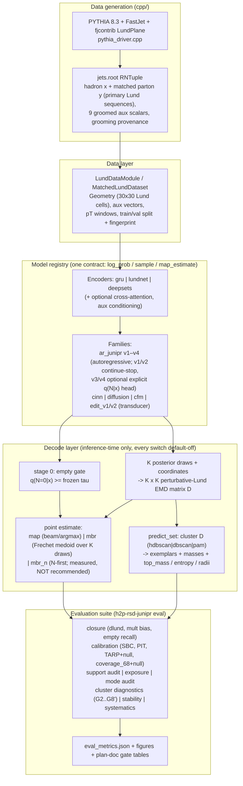
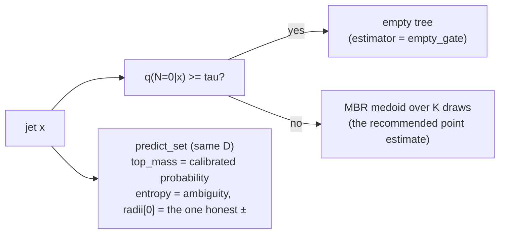

# SUMMARY — model status, findings, and where improvement lives

Last updated: 2026-08-05, branch `stratifiedMBR`. This document consolidates the state of
the hadron→parton posterior — what has been tested, what fell, what stands, and what to do
next — so the conclusions do not have to be reassembled from eight plan documents. Every
number links back to a primary record; nothing here is a new measurement.

Primary records: `PROD_TEST_v0_RESULTS.md`, `PROD_TEST_v1_RESULTS.md`,
`PROD_TEST_edit_RESULTS.md`, `PLAN_PosteriorClusters.md` (implementation notes),
`PLAN_StratifiedMBR.md` §1a–§1c, and the run artifacts under
`runs/prod_test_v1/v1_contstop_s0/…/` (`per_jet_clusters.json`,
`per_jet_clusters_K1000.json`, `eval_metrics_wp34.json`).

---

## 1. The framework, end to end

The decode decision flow for a single jet, as currently recommended:

---

## 2. What has been established, by test campaign

### 2.1 Production test v0 → v1 (`PROD_TEST_v1_RESULTS.md`)

| finding | evidence | status |
|---|---|---|
| `lnz_support="physical"` closes the support leak completely | 0.83% below-soft-drop and 3.94% `z>½` → 0.0000% on all seeds | **closed** |
| The residual ln z failure is a *shape* mismatch, not support | `ln_z × wide_soft` PIT at **2.16×** its critical value on 2 671 emissions (94% of the bulk); best seed still misses by 5% | **open — the spline escalation fired and was never built** |
| SBC-on-N "failure" was a wrong reference | χ² 215.6 vs "crit 16.90" — but N takes 7 values; against its own simulated null: 88th percentile ⇒ consistent with calibrated | corrected in v1 |
| The joint tree posterior is too narrow, and it is the **multiplicity factorization** | TARP at n=2000 with MC null: all six explicit-`q(N|x)` arms fail G7, both continue/stop arms pass | **continue/stop is the fielded family** |
| Family A/B: continue/stop wins | held-out NLL −0.124 nat, TARP 0.021 vs 0.037, both clearing seed spread | decided |
| Aux isolation is null | `ln_pt + abs_eta` carry the whole aux gain; 9-column delta inside seed spread; jets that *cannot* receive aux "gain" as much | **encoder-input expansion not justified**; full-tree-LundNet trigger did **not** fire |
| Encoder probe (lundnet/gru/deepsets) | one seed each; NLL differences small, gru worse PITs | no evidence the encoder is the bottleneck |
| Empty parton tree (~17% of jets) needs its own decision | `q(0|x)` AUC 0.824, scale ratio 1.026, Brier reliability 1.5e-4; τ = 0.3506 frozen by rate-matching; recall 0.46 / precision 0.44 | **gate implemented and calibrated**; per-jet accuracy is the limit, not the scale |
| Edit transducer (`e_v1/e_v2`) | loses the head-to-head to `v1_contstop` on the readable axes (TARP band 3.4× the reference) | not fielded |

### 2.2 Posterior clusters (`PLAN_PosteriorClusters.md`, 600 jets, K=200 and K=1000)

| gate | result | reading |
|---|---|---|
| G2 medoid-in-dominant-cluster | 0.468 (hdbscan) / 0.648 (pam) — verdicts agree | the medoid often leaves the dominant cluster; **kill criterion does not fire** |
| G2′ set value vs mass-matched random-partition null | **+0.603 ± 0.048** (K=200) → **+0.676 ± 0.049** (K=1000) | the partition carries real information (~12σ); survives the silhouette precondition |
| G3 empty stratum mass = q(0\|x) | 0.00000, both K | exact by construction — the N=0 clique **is** the calibrated empty probability |
| G6 reliability of `top_mass` | ECE 0.197→**0.040** at T=0.83, slope 0.97, Brier resolution 0.079 (K=200) | **calibrated AND informative** — the scalars predict the set's error (0.73/0.79 most/least-confident RMS ratios) and not the medoid's |
| G7 conformal coverage, exemplar rule | 0.617 [0.577, 0.655] vs nominal 0.68 — **unreachable** | the ceiling is the **reporting rule**: same sets at the pool's own resolution cover **0.793** (see §2.3) |
| G8′ empty-clique dominance | bounded argmin collapses to empty on **24.5%** vs a 1% ceiling | WP4b (bounded loss) stays closed, independently confirmed |
| the mass argmax as a point estimate | `set0` 11–14% worse RMS than the medoid, CIs excluding 1; over-selects empty **0.455** (hdbscan) vs true 0.167 — a granularity artifact (the N=0 stratum is atomic, the rest fragments) | **`members[0]` is not a tree to ship**; the frozen-τ gate fixes the emptiness completely (0.455→0.130) and moves nothing else |
| K=1000 arm | silhouette precondition 46.2%→**66.3%**, `<n_clusters>` 4.89→3.95, G2′ up | the "unresolvable half" was partly budget; **but** `min_cluster_size ∝ K` confounds G6 across K (residual mass 0.284→0.362, unassigned 35.7%→43.5% while the pool support *improved*) — G6's cross-K row is unscored |

### 2.3 Stratified MBR + the two audits (`PLAN_StratifiedMBR.md` §1a–§1c)

| finding | evidence | consequence |
|---|---|---|
| **`mbr_n` (N-first decode) fails its own pre-registered gate** | Δ = d(medoid) − d(mbr_n) = **−0.083** [−0.128, −0.039] at K=200; **−0.084** [−0.135, −0.030] at K=1000 | significantly *farther* from truth; ships as `point_estimator="mbr_n"`, documented measured-not-recommended |
| Both components lose independently | de-smearing alone −0.043 (cross-stratum distances are inflated but **not noise**); the calibrated median picks N no better than the medoid (0.448 vs 0.443 exact) | both premises of the estimator were wrong |
| **The N channel is the biggest priced lever** | stratified at *true* N: **1.67** vs medoid **2.33** (~0.7 EMD); `P(median = n_true) = 0.4483` at K=200 **and** K=1000, identical to 4 decimals | `q(N|x)` is **calibrated but not sharp** — the residual is information the *model lacks*, not information the decode fails to use |
| **`coverage_68` was never evidence of over-confidence** | its own null (model as truth, same K-draw HPD): **0.553** [0.543, 0.563] on 8 841 pseudo-truths; observed 0.546 sits inside it | a perfect model scores 0.553 at K=200, not 0.68 — the deficit is the estimator (HPD from K draws misses cells with p<1/K). Correction note added to `PROD_TEST_v1_RESULTS.md`; **TARP is unaffected** (own MC null), so joint-narrowness now rests on TARP + the PIT cross |
| G7's ceiling is the reporting rule, measured | same sets: exemplar rule 0.617, pool-resolution rule **0.793**, nominal 0.68 | the model's support is fine (`d(truth, nearest draw)` = 0.09 of the pool's scale); a residual 20.7% support gap is real and stated |
| Three selection rules lost to plain centrality | mass argmax 2.72, medoid's-cluster 2.31, N-first 2.43 — vs medoid 2.33 | **the decode layer is exhausted** |

---

## 3. The overall conclusion

**The encoder is not the bottleneck** (three independent lines: v1's attribution, the null
aux A/B, the flat encoder probe), **and the decode layer is now exhausted** (three
selection rules lost to the plain medoid at two budgets; the gate composition works; the
bounded loss is structurally unsafe).

**The recommended per-jet product today:**
- point estimate: **the MBR medoid**, with the frozen-τ empty gate (`decode.empty_threshold`);
- uncertainty: **the cluster set** — `top_mass` as a calibrated probability (after one
  temperature), `entropy` as the per-jet ambiguity, `radii[0]` as the one honest ±,
  quoted at the **K=1000 tier**;
- population-level: the decode-free posterior series, as before.

**The two remaining levers, both decoder/head-side, both priced:**

| lever | size | the concrete next act |
|---|---|---|
| **N channel** | ~0.7 EMD (oracle-N 1.67 vs 2.33) | first *decide whether it is reachable*: the ceiling probe of §4.1. `q(N\|x)` is calibrated (rate, ranking) but right on only 44.8% of jets, at any sampling budget — the question is whether `x` carries more N information than the generative model extracts |
| **ln z shape** | 2.16× critical PIT in the quadrant holding 94% of emissions | the RQ-spline head — **pre-authorized in v1 (§4.4), fired, never built** — then the joint coordinate density if the spline does not close it (`ln z = u + v − ln p_T,sum` holds exactly, so independence-given-cell is violated by a kinematic identity) |

**Explicit stop-signs** (measured dead ends — do not respend effort here):
- new selection rules over the existing posterior (three straight losses);
- aux-column expansion (isolation null; the full-tree-LundNet trigger did not fire);
- encoder swaps (probe flat, v1 attribution elsewhere);
- the bounded/kernel MBR loss as a product (G8′ fails at 24.5% vs a 1% ceiling);
- reading `coverage_68` against 0.68 (its null is 0.553 at K=200 — always quote it with K).

---

## 4. Next steps

### 4.1 Diagnostics (cheap, decisive first)

1. **The N-information ceiling probe** — the single most decisive open measurement
   (proposed in `PLAN_NCeilingProbe.md`, not yet approved/implemented). Train a
   *discriminative* predictor of `n_true` from `(x, aux)` (HistGradientBoosting on
   sequence summaries + the 9 aux columns; train on `data/jet_aux_asym.root`, score on
   the same 600 test jets). Beats 0.448 ⇒ the length channel under-extracts and the
   `mbr_n` machinery exploits a sharper n̂ immediately; ties ⇒ no evidence of headroom,
   the ambiguity is hadronization physics, and the set layer is the right product for N.
2. **Transfer the `coverage_68` null to one explicit-`q(N|x)` arm** (where TARP *does*
   fail) — one `eval` run with `experiment.coverage_null_reps=20`. Confirms the null
   lands near 0.553 there too, so the correction is family-independent.
3. **Pin `cluster_min_cluster_size=10` at K=1000** — one notebook run. Separates "more
   draws" from "coarser clustering" and un-confounds G6's cross-K comparison.
4. **Per-jet rows in the cluster artifact**, so gate G5's paired criterion becomes
   computable instead of falling back to "quote the K=1000 tier".

### 4.2 Model extensions (pre-authorized, in order)

1. **RQ-spline ln z head** — `model.lnz_head = "truncnorm" | "spline"` (Durkan et al.,
   arXiv:1906.04032) on the same soft-drop interval, bit-identical off path, 3-seed
   training at the v1 budget, G3 PIT re-test against the recorded 1.05–2.07× numbers.
   The cheaper of the two fired escalations and it does not disturb the factorization.
2. **Length-channel improvement — gated on the ceiling probe.** Only if 4.1(1) shows
   headroom: options in increasing order of surface — a discriminatively-trained
   auxiliary N-head used *only at decode time* (feeding the existing
   `stratified_medoid`), a recalibrated continue head conditioned on richer summaries,
   or capacity in the decoder's continue/stop path. Not before the probe.

### 4.3 Exploring new models (structural, only if the above stall)

1. **Per-node joint coordinate density** (cINN-coords / CFM-coords, `PLAN_UPDATES.md`
   WP1) — the second fired escalation; structurally motivated by the exact kinematic
   identity, and the fallback if the spline closes the marginal PIT but TARP still fails.
2. **Not currently justified** (triggers measured false, listed so they are not
   re-proposed by default): full-tree LundNet with secondary-plane sequences (aux
   isolation was null); the edit transducer as the fielded family (lost the head-to-head);
   consensus/lattice MBR or any decode that leaves `H = {pool}`.

---

## 5. Methodological notes that keep paying for themselves

Recorded because each one caught a wrong conclusion this cycle:

- **Simulate the reference, never assume it.** SBC-on-N (χ²(9) vs a 7-valued N) and
  `coverage_68` (0.68 vs an HPD built from K draws) were the *same error twice* in one
  suite; both flipped when scored against their own simulated nulls.
- **Pre-register the gate before running the cell.** `mbr_n`'s ship gate was written in
  the notebook markdown above the code; the estimator failed it and the failure is a
  clean result instead of a negotiation.
- **Pair the comparison or don't call it one.** `set0` looked ~40% better than the medoid
  on each series' own subset and is 11–14% *worse* on identical rows.
- **A verdict label must cover both tails**: a CI entirely below zero "excludes 0" too —
  the gate printer briefly reported a significant loss as a null result.
- **Method-stable statements need method-stable rules**: the exemplar support rule swung
  35.7%↔8.2% with the clustering method on identical jets; the pool-resolution rule
  cannot move by construction.
- **Preserve the artifact a conclusion was read from** (`per_jet_clusters_K{K}.json`,
  `eval_metrics_wp34.json`, backups before overwriting) — twice this cycle an artifact
  nearly masqueraded as another run's evidence.
