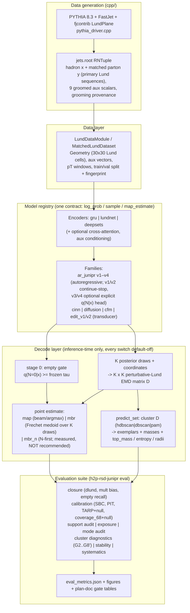
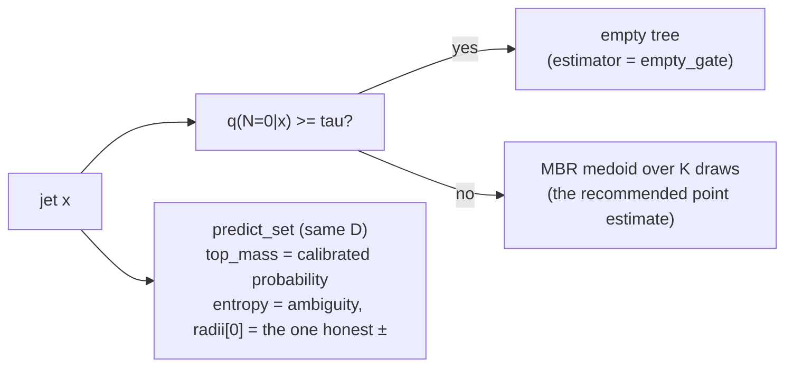

# SUMMARY — model status, findings, and where improvement lives

Last updated: 2026-08-06, branch `nextStepsTrackAB`. This document consolidates the state
of the hadron→parton posterior — what has been tested, what fell, what stands, and what to
do next — so the conclusions do not have to be reassembled from eight plan documents. Every
number links back to a primary record; nothing here is a new measurement.

Primary records: `PROD_TEST_v0_RESULTS.md`, `PROD_TEST_v1_RESULTS.md`,
`PROD_TEST_edit_RESULTS.md`, `PLAN_PosteriorClusters.md` (implementation notes, **§18** the
truth/draw representation audit, **§19** the budget scan),
`PLAN_StratifiedMBR.md` §1a–§1d and **§1e** (the `coverage_68` null transfer),
`PLAN_NCeilingProbe.md` §A,
`PLAN_lnz_spline_head.md` §6, §8, §9 and **§10/§11** (the continue/stop TARP transfer),
`PLAN_z_aware.md` §11 and §13 (WP-0 null; WP-3 indicated) and **§14/§15** (the default-decode arm),
`PLAN_next_steps.md` (the ordered execution list, **§8** its results),
and the run artifacts under
`runs/prod_test_v1/v1_contstop_s0/…/` (`per_jet_clusters.json`,
`per_jet_clusters_K1000.json`, `eval_metrics_wp34.json`),
`runs/n_ceiling_probe/20260805-122832/n_ceiling_probe.json` and
`runs/lnz_spline/lnz_spline_gates.json` and
`runs/lnz_spline/offset_head_diagnostic.json` and
`runs/lnz_spline/offset_head_diagnostic_cellctr.json` and
`runs/zaware_wp0/full-20260806-131513/wp0.json` (300 jets) and
`runs/zaware_wp0/esc1000-20260806-132207/wp0.json` (the 1000-jet escalation) and
`runs/zaware_sel/full-20260806-143047/ceiling.json` (the §12/§13 selection ceiling) and
`runs/zaware_default/full-20260806-163256/default.json` (the §14/§15 default-decode arm) and
`runs/truth_cloud_audit/full2-20260806-162840/audit.json` (the §18 representation audit) and
`runs/cluster_budget/full-20260806-171520/budget.json` (the §19 budget scan) and
`runs/coverage_null/full-20260806-164231/coverage_null.json` (the §1e null transfer).

---

## 1. The framework, end to end

The decode decision flow for a single jet, as currently recommended:

---

## 2. What has been established, by test campaign

### 2.1 Production test v0 → v1 (`PROD_TEST_v1_RESULTS.md`)

| finding | evidence | status |
|---|---|---|
| `lnz_support="physical"` closes the support leak completely | 0.83% below-soft-drop and 3.94% `z>½` → 0.0000% on all seeds | **closed** |
| The residual ln z failure is a *shape* mismatch, not support | `ln_z × wide_soft` PIT at **2.16×** its critical value on 2 671 emissions (94% of the bulk); best seed still misses by 5% | **open — the spline escalation fired and was never built** |
| SBC-on-N "failure" was a wrong reference | χ² 215.6 vs "crit 16.90" — but N takes 7 values; against its own simulated null: 88th percentile ⇒ consistent with calibrated | corrected in v1 |
| The joint tree posterior is too narrow, and it is the **multiplicity factorization** | TARP at n=2000 with MC null: all six explicit-`q(N\|x)` arms fail G7, both continue/stop arms pass | **continue/stop is the fielded family** |
| Family A/B: continue/stop wins | held-out NLL −0.124 nat, TARP 0.021 vs 0.037, both clearing seed spread | decided |
| Aux isolation is null | `ln_pt + abs_eta` carry the whole aux gain; 9-column delta inside seed spread; jets that *cannot* receive aux "gain" as much | **encoder-input expansion not justified**; full-tree-LundNet trigger did **not** fire |
| Encoder probe (lundnet/gru/deepsets) | one seed each; NLL differences small, gru worse PITs | no evidence the encoder is the bottleneck |
| Empty parton tree (~17% of jets) needs its own decision | `q(0\|x)` AUC 0.824, scale ratio 1.026, Brier reliability 1.5e-4; τ = 0.3506 frozen by rate-matching; recall 0.46 / precision 0.44 | **gate implemented and calibrated**; per-jet accuracy is the limit, not the scale |
| Edit transducer (`e_v1/e_v2`) | loses the head-to-head to `v1_contstop` on the readable axes (TARP band 3.4× the reference) | not fielded |

### 2.2 Posterior clusters (`PLAN_PosteriorClusters.md`, 600 jets, K=200 and K=1000)

| gate | result | reading |
|---|---|---|
| G2 medoid-in-dominant-cluster | 0.468 (hdbscan) / 0.648 (pam) — verdicts agree | the medoid often leaves the dominant cluster; **kill criterion does not fire** |
| G2′ set value vs mass-matched random-partition null | **+0.603 ± 0.048** (K=200) → **+0.676 ± 0.049** (K=1000) | the partition carries real information (~12σ); survives the silhouette precondition |
| G3 empty stratum mass = q(0\|x) | 0.00000, both K | exact by construction — the N=0 clique **is** the calibrated empty probability |
| G6 reliability of `top_mass` | ECE 0.197→**0.040** at T=0.83, slope 0.97, Brier resolution 0.079 (K=200) | **calibrated AND informative** — the scalars predict the set's error (0.73/0.79 most/least-confident RMS ratios) and not the medoid's |
| G7 conformal coverage, exemplar rule | 0.617 [0.577, 0.655] vs nominal 0.68 — **unreachable** | the ceiling is the **reporting rule**: same sets at the pool's own resolution cover **0.793** (see §2.3) |
| G8′ empty-clique dominance | bounded argmin collapses to empty on **24.5%** vs a 1% ceiling | WP4b (bounded loss) stays closed, independently confirmed |
| the mass argmax as a point estimate | `set0` 11–14% worse RMS than the medoid, CIs excluding 1; over-selects empty **0.455** (hdbscan) vs true 0.167 — a granularity artifact (the N=0 stratum is atomic, the rest fragments) | **`members[0]` is not a tree to ship**; the frozen-τ gate fixes the emptiness completely (0.455→0.130) and moves nothing else |
| K=1000 arm | silhouette precondition 46.2%→**66.3%**, `<n_clusters>` 4.89→3.95, G2′ up | the "unresolvable half" was partly budget; **but** `min_cluster_size ∝ K` confounds G6 across K (residual mass 0.284→0.362, unassigned 35.7%→43.5% while the pool support *improved*) — G6's cross-K row is unscored, **and §19 shows it cannot be un-confounded by that knob at all** — budget and granularity move every partition statistic in opposite directions at comparable size, so the committed pair's small deltas are a near-cancellation. What K *does* buy, cleanly separated: `d_mbr` −0.0426 [−0.0695, −0.0194] |

### 2.3 Stratified MBR + the two audits (`PLAN_StratifiedMBR.md` §1a–§1c)

| finding | evidence | consequence |
|---|---|---|
| **`mbr_n` (N-first decode) fails its own pre-registered gate** | Δ = d(medoid) − d(mbr_n) = **−0.083** [−0.128, −0.039] at K=200; **−0.084** [−0.135, −0.030] at K=1000 | significantly *farther* from truth; ships as `point_estimator="mbr_n"`, documented measured-not-recommended |
| Both components lose independently | de-smearing alone −0.043 (cross-stratum distances are inflated but **not noise**); the calibrated median picks N no better than the medoid (0.448 vs 0.443 exact) | both premises of the estimator were wrong |
| **The N channel is the biggest priced lever** | stratified at *true* N: **1.67** vs medoid **2.33** (~0.7 EMD); `P(median = n_true) = 0.4483` at K=200 **and** K=1000, identical to 4 decimals | `q(N\|x)` is **calibrated but not sharp** — and §2.4 now shows the residual is information ***x* lacks**, not information the model or the decode fails to use |
| **`coverage_68` was never evidence of over-confidence** | its own null (model as truth, same K-draw HPD): **0.553** [0.543, 0.563] on 8 841 pseudo-truths; observed 0.546 sits inside it | a perfect model scores 0.553 at K=200, not 0.68 — the deficit is the estimator (HPD from K draws misses cells with p<1/K). Correction note added to `PROD_TEST_v1_RESULTS.md`; **TARP is unaffected** (own MC null), so joint-narrowness now rests on TARP + the PIT cross |
| G7's ceiling is the reporting rule, measured | same sets: exemplar rule 0.617, pool-resolution rule **0.793**, nominal 0.68 | the model's support is fine (`d(truth, nearest draw)` = 0.09 of the pool's scale); a residual 20.7% support gap is real and stated |
| Three selection rules lost to plain centrality | mass argmax 2.72, medoid's-cluster 2.31, N-first 2.43 — vs medoid 2.33 | **the decode layer is exhausted** |

### 2.4 The N-information ceiling probe (`PLAN_NCeilingProbe.md` §A, `scripts/n_ceiling_probe.py`)

The one measurement that decided where the *next* effort goes. A **discriminative**
predictor of `n_true` from `(x, aux)` — 460 594 training jets, 29 features, scored on the
same 600 test jets as everything above. Because predicting a label is far easier than
carrying a correct generative posterior, its accuracy is a **lower bound** on the
multiplicity information `x` carries.

| predictor | exact | 95% Wilson | mean \|Δn\| |
|---|---:|---:|---:|
| probe, x + aux (median) | **0.4550** | [0.416, 0.495] | 0.620 |
| probe, x only (median) | 0.4433 | [0.404, 0.483] | 0.628 |
| **`q(N\|x)` posterior median** | **0.4583** | [0.419, 0.498] | 0.608 |
| `n_x` | 0.3767 | [0.339, 0.416] | 0.800 |
| majority class | 0.3950 | [0.357, 0.435] | 0.775 |

| finding | evidence | consequence |
|---|---|---|
| **The length channel does not under-extract** | probe 0.4550 vs posterior median 0.4583; paired McNemar **36 vs 38, p = 0.91** | **no evidence of headroom** — the residual N ambiguity behaves like hadronization physics, not like a modelling failure |
| **…and the probe is a working instrument**, so the tie is informative | beats the majority class **p = 0.0064** (101 vs 65) and `n_x` **p = 0.00083** (119 vs 72) | a null from a probe that could not learn would measure nothing; this one learns real structure and still lands on `q(N\|x)` |
| **…and it was not starved** | learning curve flat over a **20×** range of training data (23 k → 461 k jets: 0.482 → 0.447, last step +0.007) | the tie is about the information in `x`, not the training budget. Fit-to-fit range 0.063 vs a 0.079 Wilson width — **comparable**, so the test resolves N beliefs to ~0.08 and no smaller; that is the bar a future claim of a win must clear |
| **Aux is null for N too** | x+aux 0.4550 vs x-only 0.4433, paired **p = 0.36** | the *third* independent line clearing the aux columns, on the one quantity they were suspected to help |
| **The oracle lever is real and unreachable** | oracle-N **1.721**, medoid **2.349**, Δ **+0.629** [+0.514, +0.752]; the probe's own n̂ fed to `stratified_medoid` gives **−0.062** [−0.123, −0.001] | at ~45% accuracy, *deciding* N is worse than *not* deciding it — the 55% wrong pay more than the 45% right win |
| **Sanity: same jets, same decode** | d(medoid) recorded 2.3489 → re-measured **2.3495** (0.03%) | the comparison is against the right population; the 0.448 → 0.458 shift is the statistic's own K-draw MC noise (6 jets of 600) |

### 2.5 The RQ-spline `ln z` head (`PLAN_lnz_spline_head.md` §6, `model.lnz_head="spline"`)

v1's other open lever, built and measured. A monotone rational-quadratic spline (Durkan et
al., arXiv:1906.04032) on the soft-drop interval, replacing the truncated normal's
`(mean, sigma)`. 3 seeds at the v1 budget plus a continue/stop transfer arm; controls are
the v1 arms themselves, same preset and same seeds.

| arm | `ln z` KS | ×crit | was | bulk cell | was | val NLL | Δ | TARP G7 |
|---|---:|---:|---:|---:|---:|---:|---:|:---:|
| `spline_s0` | 0.0120 | **0.47×** | 2.07× | **0.48×** | 2.16× | 3.846 | **−0.078** | no → **yes** |
| `spline_s1` | 0.0163 | **0.64×** | 1.05× | **0.75×** | 1.17× | 3.861 | **−0.043** | no → **yes** |
| `spline_s2` | 0.0266 | 1.04× | 1.84× | 1.04× | 1.91× | 3.860 | **−0.064** | no → no |
| `contstop_spline_s0` *(transfer)* | 0.0268 | 1.05× | 1.89× | 1.08× | 1.95× | 3.739 | **−0.041** | yes → yes |

| finding | evidence | consequence |
|---|---|---|
| **G3 is PARTIAL, not closed** | both pre-registered clauses hold on 2/3 seeds; seed 2 misses by 4% (KS p = 0.035) | a 1.6–4.4× improvement on every seed, and still a fail by the rule written in advance. Reported as partial |
| **The first change to improve likelihood AND calibration together** | NLL −0.041 to −0.078 nat on 4/4 arms against a control seed spread of **0.020**; `pit_ks_max` better on 4/4 | every earlier intervention moved one or neither. Worth fielding on its own numbers |
| **The support closure was not spent** | 0.00000% below soft drop and above `z = ½` on every arm — by construction, since the spline maps the interval onto itself | v1's WP-A property is preserved, not traded |
| **The residual MOVED to `dv`** | `dv` now fails on all three seeds (1.10× / 1.04× / 1.12×) and `dv × wide_soft` sits at ~1.0×, while `ln z` is 0.47–1.04× | it became the binding coordinate — and §2.6 then measured that the same fix does **not** work on it |
| ~~**TARP moved, mostly the right way**~~ — **REWRITTEN 2026-08-06: TARP is unresolved at this bar on BOTH families** | the explicit arms are −0.0200, −0.0085, +0.0065 (2/3 by sign, mean **−0.0073**); the fielded continue/stop arms, measured for the first time on three seeds, are +0.0055, −0.0030, −0.0190 (2/3 by sign, mean **−0.0055**). Both means sit inside TARP's own MC spread (null mean 0.0167, p95 0.0275). A pre-registered bar of −0.0085 on the mean is cleared by **neither** | not "the coordinate density was contributing to the joint narrowness too" — that read a 2/3 sign pattern whose mean is smaller than the statistic's noise. §4.2(4) asked for the arm that would settle it and it settled the other way. `PLAN_lnz_spline_head.md` §10/§11 |
| ~~**d(MBR) is marginally worse on 4/4**~~ — **WITHDRAWN 2026-08-06: `d(MBR)` is unchanged within its own per-jet noise** | the 4/4 signing (+0.0047, +0.0113, +0.0091, +0.0031) was four *unpaired* means. Paired per-jet at the same tier: **95% CI contains 0 on 4/4**, each ~±0.03 wide against a +0.005 effect. At the pre-declared 1000-jet escalation the **signing itself does not survive** — 3/4, with `spline_s0` significantly *better* (−0.0211 [−0.0357, −0.0065]) — and the pool over **3273 paired jets is −0.0014 [−0.0089, +0.0062]** | the sentence is **rewritten, not explained** — that consequence was fixed in advance (`PLAN_z_aware.md` §4/WP-0), and an explanation is not owed for a number that is not resolved. The *other* half fails too: under the new ruler that does see `ln z`, the MBR winner's own `\|Δ ln z\|` is flat (+0.0003 [−0.0109, +0.0117]), so there was no hidden gain for a blind ruler to miss. **Both open reservations about `lnz_head="spline"` are now one** (G3 formally PARTIAL at 5/6). `PLAN_z_aware.md` §11 |
| **A design the measurement rejected** | composing the spline on a *learnable* truncated normal is non-identifiable: `lnz_mean` → −533 on an interval of [−2.303, −0.693], `F_TN` saturated on 100% of emissions, val NLL 4.19 → 19.2 at epoch 4 | the base must be parameter-free. Recorded in `distributions.py` and pinned by a regression test so the appealing-but-broken construction is not re-proposed |

### 2.6 The follow-up grid — `dv`, more seeds, more bins (`PLAN_lnz_spline_head.md` §8)

Three questions, one grid, and the headline is a **negative result that is more useful than
the positive one would have been**.

| finding | evidence | consequence |
|---|---|---|
| **The `dv` spline does not work** | G3-dv **0/3**: `dv` 1.10→1.22×, 1.04→1.12×, 1.12→1.02× against its own same-seed control; bulk cell worse on all three; NLL +0.016/+0.000/+0.028; TARP regresses on 2/3 (seeds 0 and 1 go from passing G7 to failing) | ships **measured-and-not-recommended**, like `mbr_n`. There is no reading of the table on which it should be fielded |
| **…and it falsifies the tilt-budget prediction that motivated it** | the per-cell mean-PIT pattern is **identical** under both families — .523/.489/.512/.484/… (truncnorm) vs .525/.492/.513/.488/… (spline) | the defect is a per-cell **location bias**, not a within-cell shape. It is a limit on what the head can *predict from its conditioning*, not on what its density can *express* |
| **G3 over six seeds: 5/6** | `ln z` 0.47 / 0.64 / **1.04** / 0.72 / 0.90 / 0.64×, mean 0.74× | §7.2a's question answered: **1-in-6, not 1-in-3**. Formally still PARTIAL (the gate says every seed), but five of six sit comfortably under the line |
| **`K = 16` is inconclusive and confounded** | seed 2's `ln z` 1.04→0.80×, but `psi` **0.61→1.49×** and `pit_ks_max` 0.0287→0.0380; and changing `K` changes the parameter count, hence the init, hence the draw | cannot separate "more capacity" from "a different draw", and it broke an untouched coordinate. Read as variance; **`K` stays 8 and was not selected against G3** |
| **The six-seed NLL band** | 3.834–3.862 vs the control's 3.904–3.924 | tighter than *and* entirely below the control — `lnz_head="spline"` is worth fielding on its own numbers |
| **The conditioning fix changes nothing either** (§8.5(1), `PLAN_lnz_spline_head.md` §9.3) | pre-registered verdict **DEAD**: giving the head the cell's continuous centre leaves `dv` at 1.08 / 1.12 / 1.13× (**0/3** below critical) and the per-cell bias RMS at 0.0295 / 0.0303 / 0.0314 against 0.0300 / 0.0302 / 0.0303 — **within ±4%** of a ±20% band; NLL unmoved | **two mechanisms proposed for `dv`, two falsified.** The defect's existence is solid (13/13 arms); its cause is not established. Every fix *inside* the per-coordinate factorization has now failed |

### 2.7 The `ln z`-aware ruler, and whether `d(MBR)` regressed at all (`PLAN_z_aware.md` §11)

§4.1(4)'s diagnostic, run. Two questions in one pass: *is there a regression to explain*, and
*can a ruler that sees `ln z` see what the spline did*. The instrument is a per-jet **paired**
analysis — legitimate because `dlund_identity` is a model-independent function of the jets and
is bit-identical within all four pairs — and never run before, because every published
`dlund_*` comparison in this repo was a difference of unpaired means.
`scripts/mbr_zaware_ab.py`, 16 decode passes: 8 arms at the published tier, 8 at the
escalation this plan declared in advance.

| finding | evidence | consequence |
|---|---|---|
| **There is no regression to explain** | paired BCa 95% CI contains 0 on **4/4** pairs at 300 jets (+0.0039, +0.0061, +0.0139, +0.0032, each CI ~±0.03); at the pre-declared **1000-jet** escalation the 4/4 signing does not survive — 3/4, with `spline_s0` significantly **better** (−0.0211 [−0.0357, −0.0065]) — and the pool over 3273 paired jets is **−0.0014 [−0.0089, +0.0062]** | **INCONCLUSIVE-BY-CONSTRUCTION** twice, which by the plan's own pre-registered rule **rewrites** §2.5's sentence instead of explaining it. `lnz_head="spline"`'s `d(MBR)` reservation is discharged |
| **…and the harness is not what moved** | G-repro **8/8 at 0.00%** — every arm re-measured its committed `dlund_mbr` to all four printed digits, 247/247 jets; G-pair 4/4 at `max\|Δ\| = 0` | a re-measurement this exact makes the null a statement about the models. (The runner mirrors `cli.py`'s call order, so the RNG stream is consumed identically rather than merely re-seeded) |
| **The ruler was blind, and there was nothing behind it** | with `ln z` restored to the score, the MBR winner's own `\|Δ ln z\|` is flat: +0.0003 [−0.0109, +0.0117] pooled at 1000 jets (2/4 arms positive) | §2.5's mechanism ("a better `ln z` cannot help a `lnDR_lnkt` metric") is literally true and was explaining nothing. The head's `ln z` gain is real in its marginal PIT and does **not reach the selected tree's leading emission** — structurally, since `sample_batch` returns **cell chains**, so the head reaches the fielded decode only through training |
| **`mbr_coords="+lnz"` was inert and now cannot be** | `lund_cloud` hard-coded `ln z = psi = 0` for cell chains, so `+lnz` appended a constant-zero column and changed **no distance**, and `mbr_weight="z"` was bit-identical to `unit`. It now **raises** | the knob is loud-and-unavailable rather than silently wrong. Making it *functional* (WP-3) was gated on a phenomenon that does not exist, so it was not built — and no committed artifact is affected, since no config on disk ever set it |
| **The ruler itself ships** | `dlund3_*_cont` (3-D over `u, v, ln z`), `dlnz_*`, and the MBR row the continuous block never had; `run_closure(per_jet=)` for paired analysis. Additive only — the metric dict was diffed before and after and contains nothing but additions | future `d(MBR)` comparisons can be paired and read at three resolutions. The 2-D↔3-D pair also prices what the cell grid throws away |
| **…but the ln z-blind SELECTION *is* worth fixing** (§12/§13, a separate pre-registered test) | the MBR winner's `ln z` is a single **draw**: it ties identity(x) (0/8 significant) while a centrality estimate off the *same* draws beats it by 0.047–0.071 on 8/8. Putting `ln z` in the EMD ground metric recovers **47–70% (mean ≈59%)** of that — `\|Δ ln z\|` 0.395–0.420 → **0.361–0.375**, −0.026…−0.047 with **8/8 CIs excluding 0**. De-quantization alone delivers **nothing** (0/8), so the gain is attributable to `ln z` specifically. B1/B2/B3 all PASS | **BUILD WP-3, default off.** The knob currently raises (WP-2) and something now wants it. **Not** the default decode: the fielded cell-centre `dlund_mbr` degrades +0.0042 [+0.0004, +0.0081] pooled, which B2 (written against the *continuous* `(u,v)` ruler) did not cover — a gap in the pre-registration, reported not resolved. Family-independent: the same size on control arms |
| **What is still open, and unrelated** | `_truth_cloud` weights the truth by `exp(v_continuous)` and every draw cloud by `exp(v_cell_centre)` — a per-point mismatch of `exp(±0.1)` plus a Jensen inflation of the truth's total mass, which the EMD charges at `R·\|ΔW\|`. `d_top`, `d_best`, `d_mbr`, `d_nearest_draw` and gates G2′/G6/G7 sit on it | a **real latent defect**, found while writing this plan and fixed only as a side effect of the WP-3 threading that did not run. It does not touch `dlund_mbr` (a plain Euclidean distance, no EMD), so it is not this section's subject — but it is not closed either |

### 2.8 Track A/B execution — WP-3 built, and four measurements (`PLAN_next_steps.md` §8)

The ordered list of `PLAN_next_steps.md`, run end to end on 2026-08-06: A1–A4, then B4, B3,
B5, B1. Two pre-registrations were committed before the arms they read
(`PLAN_z_aware.md` §14 in `fa45c9f`; `PLAN_lnz_spline_head.md` §10 in `7932089`).

| finding | evidence | consequence |
|---|---|---|
| **WP-3 is built, and bit-identical off** | `decode.mbr_cloud_source` (`"cells"`/`"coords"`); `coords_for_draws` draws the table **once**, unfiltered and index-aligned, feeding both the clouds and the winner's `describe_cells`. Verified by diffing the closure **and** cluster metric dicts against a pristine checkout from a reset RNG state (both streams): 1569 → 1641 leaf keys, **ADDED 72, REMOVED 0, MOVED 0**. +24 tests; suite green; parity at `max\|Δ\| = 0.000e+00` | `mbr_coords="+lnz"` and `mbr_weight="z"` are **functional** instead of fatal, and the fielded path is untouched. `PLAN_next_steps.md` §8.1 |
| **`+lnz` is NOT the default decode, on a rule fixed first** | jets `[1000, 2000)` — disjoint from everything §11/§12/§13 scored — through the fielded `run_closure`. **D1 FAILS**: Δ`dlund_mbr` pooled **+0.0114 [+0.0075, +0.0152]** against a +0.010 band, 4/8 arms significantly worse. **D2 PASSES** 7/8 (pooled −0.0289 [−0.0349, −0.0230]); **D3 PASSES** 8/8 with both no-EMD controls exactly 0 | **AVAILABLE-NOT-DEFAULT.** And the number that justifies the whole design: §13.3's post-hoc estimate of the same cost was **+0.0042**, low by a factor of nearly three. A rule written afterwards would have been scored against it. `PLAN_z_aware.md` §14/§15 |
| **The truth/draw representation mismatch, priced** | the *same* tree through both representations: `W_truth / W_truth_as_drawn` = **1.0030**, buying a spurious `\|ΔW\|` of **0.213** = **9.6% of `<d_mbr>`**, **72% of `<d_nearest_draw>`**. `d_mbr` itself does **not** move (+0.0024 [−0.0185, +0.0241]) | a real defect, now fixed under `"coords"` and **reported on every run** (`metrics["clusters"]["weight_audit"]`). G2/G6/G7 flip to pass under `"coords"` and §18.3 declines to bank them — the cause is de-quantization, and G6's ECE only improves because the forecaster goes nearly constant (resolution 0.0623 → 0.0109). **The committed G2/G6/G7 numbers are conditional on the cell-centre representation**, which was never stated. `PLAN_PosteriorClusters.md` §18 |
| **G6's cross-K row cannot be un-confounded by `min_cluster_size`** | four cells off ONE nested sampling pass. `mcs` is a COUNT and `min_mass` a FRACTION, so `K = 1000` gives 1.2 / 4.1 / 30.1 clusters per jet at the three conventions against the `K = 200` target of 4.9. The decomposition resolves exactly `d_mbr`, `d_nearest_draw`, `pool_bound` — the three quantities that are *not* about the partition, moved by exactly **0.0000** by the granularity. Every partition statistic is moved in **opposite directions at comparable size** by budget and granularity | §2.2's "G6's cross-K row is unscored" **stands, with a reason**; the committed pair's small deltas are a near-cancellation, not a null. It becomes an independent argument for §4.3(1). `PLAN_PosteriorClusters.md` §19 |
| **What `K` actually buys, separated from the partition for the first time** | 200 → 1000 draws: `d_mbr` **−0.0426 [−0.0695, −0.0194]**, `d_nearest_draw` −0.0681, `pool_bound` −0.2672 | ~7% of the N lever (§2.3's 0.63 EMD), bought with compute rather than information. Real, and not a substitute for it |
| **`coverage_68`'s null is family-independent** | pooled over three explicit-`q(N\|x)` seeds it is **0.5504** on 26 334 pseudo-truths against §1c's 0.553: **−0.0026 [−0.0145, +0.0094]**. Positive control: this runner re-measures §1c's arm at 0.5476 vs 0.553 | the stop-sign now rests on **two families and four arms** instead of one and one. One residual reported rather than smoothed: `v1_base_s1` is −0.067 [−0.112, −0.022] below its *own* null. `PLAN_StratifiedMBR.md` §1e |
| **…and the shipped test that read it was wrong** | `coverage_68_null_explains_deficit` asks whether the observation lies inside the *null's* interval, discarding the observation's own error — the larger by ~4×. **Simulated** on a model drawn from the null at the fielded sample sizes, it rejects **64.8%** of the time | fixed additively: `wilson_diff_interval` (Newcombe 1998 m10) plus `coverage_68_vs_null_ci` and `coverage_68_null_explains_deficit_paired`. The old key keeps its value; committed artifacts are unchanged |
| **The spline's TARP gain does not transfer — and does not clear the bar anywhere** | see §2.5's rewritten row. Continue/stop, three paired seeds: +0.0055, −0.0030, −0.0190, mean −0.0055 against a pre-registered −0.0085. The same rule on the reference family: mean −0.0073, also failing | §4.2(4) is **done** and its answer is negative. Everything *except* TARP moved on 3/3 — val NLL −0.041/−0.063/−0.095, `pit_ks_max` better on all three, `ln z` PIT 1.89→1.05, 1.23→0.72, 1.68→1.34 — so `lnz_head="spline"` is unaffected as a fielded choice. `PLAN_lnz_spline_head.md` §11 |
| **`v1_contstop_s2` fails G7** *(unanticipated)* | 0.0405 against p95 0.0275, exceeding the MC null. That control had to be trained for B1 and did not exist before | v1's attribution rested on *"all six explicit arms fail, both continue/stop arms pass"*; with a third seed it is **6/6 against 1/3**. The attribution stands; **its absolute form does not** — two arms were never enough to support "both pass" as a property of a family |
| **Per-jet rows in the cluster artifact** | `METRICS["per_jet"]`, keyed by the jet-file index so two budget tiers pair exactly; curated (the eight estimators' coordinate arrays are omitted — no gate reads them). Verified by executing the notebook | §4.1(6) done. Gate G5's paired criterion is computable. The artifact name now also carries `min_cluster_size`, and `run.cluster_min_cluster_size_effective` records what `0` resolved to — which *is* B4's confound |

---

## 3. The overall conclusion

**The encoder is not the bottleneck** (three independent lines: v1's attribution, the null
aux A/B, the flat encoder probe), **the decode layer is now exhausted** (three
selection rules lost to the plain medoid at two budgets; the gate composition works; the
bounded loss is structurally unsafe), **and the length channel is not under-extracting**
(§2.4: a discriminative probe on `(x, aux)` ties `q(N|x)` on identical jets while beating
both trivial predictors). That left the coordinate density as the one place a model change
still had a measured target — and §2.5 has now cashed part of it: splining `ln z` improves
the likelihood *and* the calibration together, the first intervention here to do both. It
also relocated the defect rather than removing it, which is what §4.2 is now organised
around.

**And the one number that argued against fielding it has since been withdrawn** (§2.7): the
`d(MBR)` regression was four unpaired means, and paired per-jet it is −0.0014 [−0.0089,
+0.0062] over 3273 jets. `lnz_head="spline"` now carries exactly one open reservation — G3
formally PARTIAL at 5/6 seeds — rather than two. That also removes the last thing standing
between the roadmap and §4.5(1).

**The recommended per-jet product today** (unchanged by §2.8 — the `+lnz` decode was
measured and is *available*, not default):
- point estimate: **the MBR medoid**, with the frozen-τ empty gate (`decode.empty_threshold`);
- uncertainty: **the cluster set** — `top_mass` as a calibrated probability (after one
  temperature), `entropy` as the per-jet ambiguity, `radii[0]` as the one honest ±,
  quoted at the **K=1000 tier**;
- population-level: the decode-free posterior series, as before.

**Of the two levers that were open, one has now been decided:**

| lever | size | status |
|---|---|---|
| **N channel** | ~0.63 EMD (oracle-N 1.72 vs medoid 2.35) | **CLOSED as a lever** (§2.4). The discriminative probe ties `q(N\|x)` on identical jets (p = 0.91) while beating both trivial predictors and sitting on a flat learning curve — no evidence that `x` carries more N information than the model already extracts. The lever is *real* (the oracle keeps its +0.63) and *unreachable*: at 45% accuracy an N decision is worse than none. It is now a **product**, not a target — the calibrated ambiguity of the set layer is the honest way to report N. |
| **ln z shape** | was 2.16× critical PIT in the quadrant holding 94% of emissions | **SPENT, and it paid — partially** (§2.5). The RQ-spline head is built, trained and measured: `ln z` falls to 0.47–1.04×, NLL improves on every seed, support unchanged. G3 is **PARTIAL** (5/6 seeds, §2.6), and the residual moved to `dv`. The one reservation that was not a gate — `d(MBR)` worse on 4/4 — **is withdrawn** (§2.7): paired per-jet it is −0.0014 [−0.0089, +0.0062] over 3273 jets. **And one claim in its favour is withdrawn too** (§2.8): the TARP improvement clears a pre-registered bar on **neither** family, so the head is fielded on NLL, PIT and support and on nothing else. |
| **`dv` shape** *(exposed by §2.5)* | `dv` fails on **13 of 13** arms measured — across two density families and with/without cell-centre conditioning (1.02–1.22×) | **Both cheap fixes are spent** (§2.6). Neither more density freedom nor better conditioning moved the per-cell bias by more than a few percent. What is left is that the *factorization* cannot represent the right marginal — which is what the joint coordinate density addresses, and why §4.5(1) is now **indicated rather than deferred**. `PLAN_lnz_spline_head.md` §9.4. |

**Explicit stop-signs** (measured dead ends — do not respend effort here):
- new selection rules over the existing posterior (three straight losses);
- aux-column expansion (isolation null; the full-tree-LundNet trigger did not fire; and now
  null for N specifically, §2.4);
- encoder swaps (probe flat, v1 attribution elsewhere);
- **a better length head, or any decode fed by one** — the ceiling probe found no sharper n̂
  to feed it, and a 45%-accurate n̂ loses to no N decision at all (§2.4);
- the bounded/kernel MBR loss as a product (G8′ fails at 24.5% vs a 1% ceiling);
- reading `coverage_68` against 0.68 (its null is 0.553 at K=200 — always quote it with K,
  and score it with `coverage_68_null_explains_deficit_paired`, **not** the point-in-interval
  key, which rejects a perfect model 64.8% of the time at the fielded sample sizes, §2.8);
- **`mbr_cloud_source="coords"` as the default decode** — *new, 2026-08-06.* It won both of
  its build gates and lost the one that asks whether it should displace the default: the
  fielded `dlund_mbr` pays +0.0114 [+0.0075, +0.0152] (`PLAN_z_aware.md` §14/§15). Ship it
  available, not default. Reopening it means moving the headline off the cell grid first,
  which is a decision about what the product is quoted on;
- **un-confounding G6 across K by changing `cluster_min_cluster_size`** — *new,
  2026-08-06.* Measured unreachable: no setting of that knob reproduces the `K = 200`
  partition at `K = 1000` (`PLAN_PosteriorClusters.md` §19). A scale-invariant partition
  rule is what would be needed, which is §4.3(1);
- **quoting the spline's TARP improvement as a finding** — *new, 2026-08-06.* It clears a
  pre-registered bar on neither family (`PLAN_lnz_spline_head.md` §11). The head is fielded
  on NLL, PIT and support, and TARP is not among its reasons.

---

## 4. Next steps — what the ceiling probe changed

> **The ordered execution list, with the file-level specs, is `PLAN_next_steps.md`.**
> This section keeps the *rationale* — why each item is on the list and what evidence
> put it there; that document keeps the *order* and the concrete diffs. When the two
> disagree, this one wins on rationale and the owning plan wins on both.

The probe's verdict re-orders everything below it. Two consequences drive the list:

- **Stop trying to make the point estimate better through N.** The lever is real and
  unreachable, and every route to it that could be tried at the decode or head layer has now
  been tried and lost. What is left is either a *different coordinate density* (§4.2) or
  *more information at the input* (§4.4) — not a smarter use of what is already there.
- **Start treating the N ambiguity as the product.** ~55% of jets genuinely do not have a
  determined parton multiplicity given `x`. A single tree cannot say that; the set can, and
  G6 already says the set's confidence scalars are calibrated and informative. §4.3 is about
  making the set say it *well*.

### 4.1 Diagnostics (cheap, decisive first)

1. ~~**The N-information ceiling probe**~~ — **done** (§2.4, `PLAN_NCeilingProbe.md` §A).
   Verdict: no evidence of headroom.
2. **The sequence-level N probe — the one measurement that could reopen the N lever.**
   The probe of §2.4 reads fixed-length *summaries*, so its null is a lower bound over that
   feature class. The sharper version costs almost nothing: take the already-trained LundNet
   encoder, freeze it, put a `n_true` classification head on the pooled embedding, score on
   the same 600 jets. Reopening the length channel means clearing **0.458 by more than the
   0.063 fit-to-fit spread** §2.4 measured — not merely the Wilson interval; failing to
   clear it converts "no evidence of headroom" into a much stronger statement, since the
   encoder sees the whole sequence the summaries compress. Pre-register the same paired
   McNemar, the same trivial-predictor controls, and the same learning curve before running
   it.
3. ~~**Transfer the `coverage_68` null to one explicit-`q(N|x)` arm**~~ — **done**
   (§2.8, `PLAN_StratifiedMBR.md` §1e). It does: pooled over three `v1_base` seeds the
   null is **0.5504** on 26 334 pseudo-truths against §1c's 0.553, difference −0.0026
   [−0.0145, +0.0094]. Three seeds rather than the one asked for, plus `v1_contstop_s0`
   as a positive control. It also turned up a **wrong test** in the shipped metric —
   `coverage_68_null_explains_deficit` rejects a perfect model 64.8% of the time — now
   fixed additively.
4. ~~**Is §2.5's `d(MBR)` regression even resolved, and is it a z-blind metric?**~~ —
   **done** (§2.7, `PLAN_z_aware.md` §11). Answer: **there is no regression to explain**,
   and the ruler that would have explained it finds nothing behind it either. The
   `ln z`-aware ruler and the inert-knob guard shipped; the coordinate threading (WP-3) and
   the 3×3 selection grid (WP-4) were gated on a phenomenon that turned out not to be
   resolved and **were not built**. One consequence to carry forward: the truth/draw
   `kt`-weight mismatch under G2′/G6/G7 was to be fixed as a side effect of WP-3, so it was
   left open — see §2.7's last row. **§12/§13 then reopened WP-3 on its own merits** and
   found for it, so that defect has an owner again.
5. ~~**Pin `cluster_min_cluster_size=10` at K=1000**~~ — **done, and the goal is
   unreachable by this route** (§2.8, `PLAN_PosteriorClusters.md` §19). `min_cluster_size`
   is a count and `min_mass` a fraction, so no setting of the former reproduces the
   `K = 200` partition at `K = 1000` (1.2 / 4.1 / 30.1 clusters per jet against a target
   of 4.9). Budget and granularity move every partition statistic in **opposite directions
   at comparable size**, so the committed cross-K pair's small deltas are a
   near-cancellation. **G6's cross-K row stays unscored, now with a reason** — and this is
   an independent argument for §4.3(1), whose top-level partition is `q(N|x)` and is
   budget-invariant by construction.
6. ~~**Per-jet rows in the cluster artifact**~~ — **done** (§2.8). `METRICS["per_jet"]`,
   keyed by the jet-file index so two budget tiers pair exactly; G5's paired criterion is
   computable. The artifact name now also carries `min_cluster_size`, and
   `run.cluster_min_cluster_size_effective` records what `0` resolved to.

### 4.2 Model extensions (pre-authorized, in order)

0. ~~**RQ-spline ln z head**~~ — **done** (§2.5, `PLAN_lnz_spline_head.md` §6). G3 PARTIAL,
   NLL better on every seed, support unchanged, residual moved to `dv`.

1. ~~**Diagnose `dv`, then spline it**~~ — **done, and the spline FAILED** (§2.6,
   `PLAN_lnz_spline_head.md` §8.1). The diagnostic ruled out the `kt_floor` edge (the cell
   touching it is one of the *best*), the tilt-budget mechanism predicted a spline would
   work, and the experiment falsified that: the per-cell bias is **identical** under both
   density families. `dv_head="spline"` ships measured-and-not-recommended.

2. ~~**Give the coordinate head the cell's continuous centre `(c_x, c_y)`**~~ — **done, and
   also FAILED** (§2.6, `PLAN_lnz_spline_head.md` §9.3). The verdict was pre-registered as
   three named outcomes before the arms ran, and it landed on **DEAD**: `dv` 0/3 below
   critical, per-cell bias RMS within ±4% of a ±20% band, NLL unmoved. Telling the head
   *where* the cells are changed nothing. `model.coord_cell_center` is implemented,
   bit-identical off, and ships unfielded.

   The pre-registration also fixed what DEAD implies, so the consequence is not a
   post-hoc reading: **the joint-density argument becomes the live one**, and 4.5(1) below
   moves from deferred to indicated.

3. ~~**Settle seed 2**~~ — **done** (§2.6). Six seeds give **5/6**, so it is a 1-in-6
   marginal seed rather than a 1-in-3 failure rate; and the `K = 16` arm is confounded with
   a re-draw (changing `K` changes the init) *and* broke `psi`, so it reads as variance.
   `K` stays at 8 and was never selected against G3.

4. ~~**A 3-seed continue/stop spline arm**~~ — **done, and the statement is negative**
   (§2.8, `PLAN_lnz_spline_head.md` §10/§11). Δ(TARP) on the fielded family is +0.0055,
   −0.0030, −0.0190 (mean **−0.0055**) against a bar of −0.0085 fixed before the arms;
   the same rule on the family the effect was *measured* on also fails (mean −0.0073).
   §2.5's TARP row is **rewritten, not qualified**. Everything except TARP moved on 3/3.
   One unanticipated finding: the control that had to be trained for this,
   `v1_contstop_s2`, **fails G7** at 0.0405 — so v1's "both continue/stop arms pass" is
   1 of 3 failing on three seeds. The attribution stands; its absolute form does not.
2. ~~**Length-channel improvement**~~ — **withdrawn.** It was gated on 4.1(1) showing
   headroom; it did not. All three options are dead for a specific reason and each is worth
   recording so none is re-proposed: the *decode-time auxiliary N-head* **is** the probe of
   §2.4 and it loses to the plain medoid by −0.062 [−0.123, −0.001]; a *recalibrated
   continue head on richer summaries* has nothing to recalibrate toward, since `q(N|x)` is
   already calibrated (G4 ratio 0.977, SBC-on-N at the 88th percentile of its own null) and
   the probe says it is also as *sharp* as these features allow; *capacity in the
   continue/stop path* is an extraction fix for an extraction failure that was not found.

### 4.3 Turn the irreducible N ambiguity into a better product

Not a new point estimate — the medoid stays, and "new selection rules" remains a stop-sign.
These change what is **reported alongside** it, which is where the probe says the value is.

1. **Stratify the set by N, instead of clustering through it.** 83% of the resolvable
   posterior ambiguity is between-N; `q(N|x)` is calibrated; gate G3 shows the empty
   stratum's cluster mass **is** `q(0|x)` exactly. Yet the partition is currently produced
   by hdbscan on `D`, which makes the N = 0 stratum atomic and *fragments* the non-empty
   continuum — the measured granularity artifact (empty selected 29.8% vs a true 16.7%),
   residual mass 0.284, unassigned 35.7%. Partitioning by multiplicity **first** and
   clustering only *within* a stratum gives a top-level partition that is exact by
   construction, carries calibrated masses, and removes the `min_cluster_size ∝ K` confound
   that left G6's cross-K row unscored. Report `q(N|x)` as the top-level mass vector and the
   within-stratum exemplars beneath it.
2. **Quote the N ambiguity explicitly per jet.** `entropy` currently mixes between-N and
   within-N ambiguity into one number. Splitting it — `H[q(N|x)]` beside the mean
   within-stratum entropy — tells a user *which kind* of ambiguity a jet has, and the first
   term is the one the probe just showed is irreducible.
3. **Re-label the oracle row wherever it appears.** `d_mbr_ntrue` = 1.72 is an *ambiguity
   scale*, not a target: after §2.4 it is measurably not achievable from `x`. Any future
   estimator claiming improvement must beat **2.35 without knowing N**.
4. **Lean on the population-level product.** Per-jet N is irreducible; population-level
   posterior series average over exactly that ambiguity, so they are where this model's
   information actually converts into a measurement. Prioritise the decode-free series and
   its systematics over further per-jet point-estimate work.

### 4.4 If more N information is genuinely wanted, it has to come from the input

The probe's real message: a better *head* cannot invent information that is not in `x`. The
only remaining routes add information, and both are data-side rather than model-side, so
both cost a regeneration + retrain and should be costed before being started.

1. **Lower the primary `kt_floor`.** `x` is traversed to 1.0 GeV while the aux columns
   already use an off-spine floor of 0.2 GeV — a factor-5 asymmetry that is deliberate and
   documented, and that throws away exactly the soft emissions whose count correlates with
   the parton multiplicity. A `kt_floor` scan (1.0 → 0.5 → 0.2 GeV) with the §2.4 probe
   re-run at each point measures the information gain **before** any model is retrained:
   the probe is the cheap instrument for exactly this question, and it is now built.
   NP/UE contamination rises as the floor drops, so the scan measures a trade, not a free
   lunch — which is why it is a measurement and not a change.
2. **Full-tree LundNet with secondary-plane sequences** (Dreyer & Qu, arXiv:2012.08526) —
   **low prior, and the reason is now sharper.** Its trigger did not fire on the aux
   isolation, and §2.4 adds that the nine *scalar* summaries of the secondary planes carry
   no N information either (p = 0.36). The sequences might carry what the scalars do not,
   but the evidence points the other way; if it is tried, the §2.4 probe fed secondary-plane
   summaries is the cheap pre-test to run first.

### 4.5 Exploring new models (structural)

1. **Per-node joint coordinate density** (cINN-coords / CFM-coords, `PLAN_UPDATES.md`
   WP1) — **now INDICATED rather than deferred**, which reverses what this section said one
   experiment ago, on evidence that changed (`PLAN_lnz_spline_head.md` §9.4).

   The reversal is the honest reading of two failures. `dv` fails on **13 of 13** arms, and
   both cheap ways of fixing it *inside* the per-coordinate factorization are now spent:
   more density freedom (§2.6, the spline) and better conditioning (§2.6, the cell centre)
   each moved the per-cell bias by less than a few percent. What survives is the argument
   this section previously recorded *against* its own conclusion — a marginal PIT is uniform
   only if the model's marginal-given-cell is right, and that marginal is obtained by
   integrating the true joint, so a factorized model **can** be forced into a wrong marginal
   by a correlation it cannot represent. The kinematic identity `ln z = u + v − ln p_T,sum`
   makes independence-given-cell false by construction, so this is a mechanism with a
   derivation rather than another hypothesis.

   The earlier restated trigger ("wait until every marginal closes") is **withdrawn**: it
   waits for a condition the diagnosis says is unreachable inside the current factorization,
   which is a deadlock rather than caution.

   **Pre-register before running**, and note the primary read is *not* TARP: does `dv`'s
   marginal PIT fall below 1.0× on every seed? That is the question two per-coordinate fixes
   failed and the one a joint density claims to answer; a joint density that fixes TARP while
   leaving `dv` at 1.1× has not explained the defect. 3 seeds, `lnz_head="spline"` both
   sides, the usual guards, and `d(MBR)` read **with its measured band** — §2.7 resolved
   that ruler to about ±0.01 over 3273 paired jets, so the caveat this line used to carry is
   replaced by a number. Note that §2.7 also *strengthens the case against firing* §4.5(1)
   at all: the `d(MBR)` reservation that made the fielded product look imperfect on a second
   axis is gone, leaving one coordinate's 10% marginal miss as the whole of the case.

   **Its relationship to `PLAN_z_aware.md`, and which runs first**, is recorded in both
   plans — `PLAN_lnz_spline_head.md` §9.5/§9.5a and `PLAN_z_aware.md` §10 — so it is not
   re-derived. In one line: that document fixes the **ruler** (the metric's and the closure
   score's `ln z`-blindness), this fixes the **model** (the factorization), and neither
   substitutes for the other. The order was z_aware **WP-0 → WP-2 → §7.3 → WP-3/4**, and
   **steps 1 and 2 are now done** (§2.7): WP-0 dissolved the `d(MBR)` question outright and
   WP-2 shipped, so **§7.3 is next and its one shared row is unblocked.** §7.3's `d(MBR)`
   may now be read straight, with the measured resolution of that ruler — ±0.01 pooled over
   3273 paired jets — as a band rather than a caveat. Nothing in `PLAN_z_aware.md` §11 bears
   on the factorization, so the pre-registration below is unchanged.

   **The caveat against firing, so the call is made with it visible.** `dv`'s miss is small
   (KS 0.026–0.029 vs a 0.0255 critical, 2–13% over) and it is now the *only* failing
   coordinate — `du`, `ln z` and `psi` are all comfortably under. A joint density is the most
   expensive change in this line of work. Whether that is worth spending on one coordinate's
   10% marginal miss is a judgement about how much joint-posterior correctness is worth, not
   a conclusion the data forces.
2. **Not currently justified** (triggers measured false, listed so they are not
   re-proposed by default): the edit transducer as the fielded family (lost the
   head-to-head); consensus/lattice MBR or any decode that leaves `H = {pool}`; any
   architecture whose stated benefit is a sharper `q(N|x)` (§2.4).

---

## 5. Methodological notes that keep paying for themselves

Recorded because each one caught a wrong conclusion this cycle:

- **Simulate the reference, never assume it.** SBC-on-N (χ²(9) vs a 7-valued N) and
  `coverage_68` (0.68 vs an HPD built from K draws) were the *same error twice* in one
  suite; both flipped when scored against their own simulated nulls.
- **Pre-register the gate before running the cell.** `mbr_n`'s ship gate was written in
  the notebook markdown above the code; the estimator failed it and the failure is a
  clean result instead of a negotiation.
- **Pair the comparison or don't call it one.** `set0` looked ~40% better than the medoid
  on each series' own subset and is 11–14% *worse* on identical rows. **And again, one
  campaign later, on a repo that had already learned it**: §2.5's "d(MBR) worse on 4/4" was
  four unpaired means over a pairing that was exact and free — every per-jet CI turned out
  to contain 0, and the whole 4/4 pattern dissolved when the jets tripled (§2.7). The lesson
  is not "pair when it is hard"; it is that an *available* pairing left untaken is a claim
  quoted at three decimals from a test that resolves to one.
- **A consistent SIGN across a handful of arms is not a small effect; it is an untested
  one.** 4/4 floors at p = 0.125 on a two-sided sign test, so the strongest statement four
  arms can make is weak — and §2.7 measured that this particular 4/4 was 3/4 at 1000 jets,
  with one arm significantly the *other* way. Before treating a signed pattern as real,
  check whether the per-unit data that would resolve it is already in hand. Here it was, at
  the cost of one `per_jet=True`.
- **Check that a proposed explanation has something to explain.** §2.5 offered a mechanism
  for the `d(MBR)` regression that was *literally correct* about the code (the metric really
  is `ln z`-blind) and was accounting for a number that does not survive its own noise.
  Building the ruler was still worth it — it is what showed that the other half of the
  sentence fails too — but the order should have been "is it resolved" before "why".
- **A verdict label must cover both tails**: a CI entirely below zero "excludes 0" too —
  the gate printer briefly reported a significant loss as a null result.
- **Method-stable statements need method-stable rules**: the exemplar support rule swung
  35.7%↔8.2% with the clustering method on identical jets; the pool-resolution rule
  cannot move by construction.
- **Preserve the artifact a conclusion was read from** (`per_jet_clusters_K{K}.json`,
  `eval_metrics_wp34.json`, backups before overwriting) — twice this cycle an artifact
  nearly masqueraded as another run's evidence.
- **A null result needs a positive control — two, in fact.** "The probe ties the model" is
  only a statement about the *data* if the probe can learn at all, and if it was not merely
  starved. `n_ceiling_probe.py` therefore reports the paired tests against the majority class
  and `n_x` (p = 0.0064 / 0.00083) *and* the learning curve over a 20× range of training data
  (flat) beside the headline. Without those rows the headline p = 0.91 would have been
  unreadable in both directions.
- **A single fit's accuracy is not its uncertainty.** Re-fitting the same probe on nested
  subsamples spans 0.418–0.482 (range 0.063) — *comparable to* the 0.079-wide Wilson interval
  on the test set, not negligible beside it. A null that rests on "these two numbers are
  close" has to price both sources, or it is quoting to three decimals a test that resolves
  to one.
- **A mechanism that contradicts a direct measurement of the same object is a hypothesis
  about something else.** The `dv` spline was built on a tilt-budget calculation showing the
  truncated normal *cannot* produce the tilt the data needs — correct arithmetic, and the
  wrong conclusion. The per-cell PIT had already shown no individual cell failing, i.e. that
  the within-cell shapes were fine; the elegant mechanism was weighted over the direct
  observation and cost a training grid. When the two disagree, the observation wins.
- **A negative result that explains itself is worth more than a positive one that does
  not** — but check that the explanation survives its own test. The `dv` spline's failure
  said "conditioning limit", the conditioning experiment then failed too, and the second
  failure is what actually moved the roadmap. Two mechanisms proposed for one defect, two
  falsified by the experiments that tested them: the *existence* of the `dv` defect is solid
  at 13/13 arms, and its *cause* is still not established.
- **Pre-register the CONSEQUENCE, not only the verdict.** §8.5(1) fixed three named outcomes
  *and what each would imply* before the arms ran. It landed on DEAD, which promoted the
  joint density from deferred to indicated — the opposite of the conclusion reached one
  experiment earlier. Because the implication was written first, that reversal is a result
  rather than a rationalisation.
- **A parameterization can be correct and still untrainable.** Composing the spline on a
  *learnable* truncated normal is exactly right as mathematics — it makes the old head the
  identity special case — and it diverges, because the two parameterizations are redundant
  and the pair walks off along the flat direction until the CDF saturates numerically. It
  showed up as one bad seed and was a latent failure of all three. **Look at the head's
  actual outputs before blaming the seed**: `lnz_mean = −533` on an interval of width 1.6
  named the cause in one measurement. And prefer removing a redundancy to bounding it.
- **A gate that fires must still be read against what the run measured.** The spline not
  closing G3 fires the joint-density escalation by the letter of its plan. But the same run
  says the biggest remaining defect is another per-coordinate one — so the letter would
  send the next month at the expensive structural change while a cheap one is sitting in
  front of it. Pre-registration binds the *verdict*, not the *next question*.
- **A post-hoc estimate of a cost is not the cost.** §13.3 priced `+lnz`'s degradation of
  the fielded headline at +0.0042, computed from stored cell ids on the jets that campaign
  had already scored. Measured on a **disjoint** slice through the code a user actually
  runs, it is **+0.0114** — nearly 3× larger, and on the other side of the band a rule
  would have been written to (§2.8). Two design choices bought that: a jet slice nothing
  had touched, and the shipped pipeline rather than a bespoke script. Both cost nothing but
  the decision to make them *before* writing the rule.
- **A "hold everything else fixed" instruction is not always executable, and finding out is
  a result.** B4 asked for `cluster_min_cluster_size=10` at `K = 1000`. That knob is a
  *count* and its sibling `cluster_min_mass` is a *fraction*, so pinning one leaves the
  other scaling and the partition collapses. No setting reproduces the reference partition.
  The useful output was not the arm the plan wanted but the demonstration that the arm
  cannot exist (§2.8) — and it re-pointed the roadmap at a scale-invariant partition rule
  it already contained for other reasons.
- **A test can be wrong in the direction that looks careful.**
  `coverage_68_null_explains_deficit` compares an observation against the *other*
  estimate's interval, which reads as conservative and is anti-conservative: it discards
  the larger of the two errors and rejects a perfect model **64.8%** of the time at the
  fielded sample sizes. It was found by transferring the metric to a second family and
  noticing that 3 of 4 arms "failed" a test they should pass. Simulate the reference —
  including the reference for a *test*, not only for a statistic.
- **A bar taken from a per-unit quantity does not transfer to a mean.** §10's T1 required
  the *mean* Δ(TARP) over three seeds to clear −0.0085, a number taken from the weakest
  improving *seed* of the reference family. With one contrary seed the mean is above the
  weakest improving instance almost by construction — so the rule was stricter than it
  read, and the reference family fails it too. The verdict stood as written (re-cutting a
  rule after the numbers is the move pre-registration prevents), and the criticism is
  recorded beside it (`PLAN_lnz_spline_head.md` §11.2).
- **Two arms are not a property of a family.** v1's attribution rested partly on "both
  continue/stop arms pass G7". The third seed, trained only because §10 needed a control,
  fails at 0.0405. The attribution survives on 6/6 against 1/3; the absolute phrasing does
  not (§2.8).
- **A statistic computed from K draws carries K-draw noise — quote the band, not the
  decimals.** The 0.4483 that this whole work package was built around re-measured as 0.4583
  on the same 600 jets with fresh draws, because for a continue/stop family `length_pmf`
  *is* the draw histogram and its median flips on jets whose belief straddles two
  multiplicities. Same lesson as `coverage_68`, one layer up: the *estimator* has a
  sampling distribution too.
